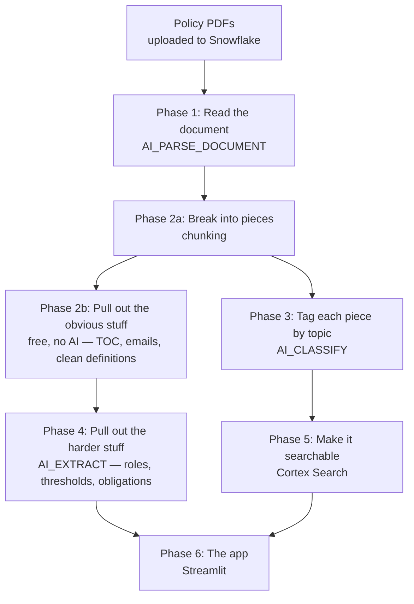

# Policy Documents App — Technical Implementation Documentation

This document explains how the policy documents application actually works, end to end. Each step is explained twice: first in plain language for anyone following along without a data engineering background, then in technical detail for anyone who needs to read, run, or maintain the actual code.

**What this system does, in one paragraph:** It takes policy PDFs, reads them the way a person would, pulls out the useful facts (definitions, who's responsible for what, numeric rules, key contacts, the table of contents), and puts all of that into a searchable app — so instead of scrolling through a 64-page PDF to find one number, you look it up on a screen, or just ask a question and get pointed straight to the right paragraph.

---

## The Flow, at a Glance



---

## Phase 0 — Setting Up the Workspace

**In plain terms:** Before doing anything with the documents, we need a dedicated space in Snowflake to work in — think of it like setting up a clean desk and a labelled filing cabinet before starting a project. We also set a spending limit up front, so the project can't accidentally run up a large bill while we're experimenting.

**Technical implementation:**

A dedicated warehouse (`policy_poc_wh`, X-Small, auto-suspends after 60 seconds idle to avoid paying for idle compute), a database and schema (`policy_poc_db.policy_poc`), and a stage (`policy_stg`) to hold the uploaded PDFs. A resource monitor caps spend at 50 credits/month with a notification at 75% and a hard suspend at 100%:

```sql
CREATE OR REPLACE WAREHOUSE policy_poc_wh WITH
    WAREHOUSE_SIZE = 'X-SMALL'
    AUTO_SUSPEND = 60
    AUTO_RESUME = TRUE;

CREATE OR REPLACE STAGE policy_stg
    DIRECTORY = (ENABLE = TRUE);

CREATE OR REPLACE RESOURCE MONITOR policy_poc_monitor WITH
    CREDIT_QUOTA = 50
    TRIGGERS ON 75 PERCENT DO NOTIFY ON 100 PERCENT DO SUSPEND;
```

We also confirm `CORTEX_ENABLED_CROSS_REGION` is set to `ANY_REGION`, since several of the AI functions used later aren't available in every Snowflake region natively.

---

## Phase 1 — Reading the Documents

**In plain terms:** A PDF isn't naturally "readable" by a computer program the way a person reads it — it's really a collection of shapes and positions on a page. This step uses Snowflake's document-reading AI to actually read each PDF the way a person would: top to bottom, understanding headings, tables, and paragraphs as such, not just as blocks of text in the wrong order. The output is a clean, structured version of each document's text.

**Technical implementation:**

`AI_PARSE_DOCUMENT` in `LAYOUT` mode reads each PDF and returns markdown-formatted text — headings become `#`/`##` markdown headers, tables become markdown pipe tables, and multi-column pages get reassembled into correct reading order. Run once per document, whole-document (not page-split), since both source PDFs are short enough (9 and 64 pages) to stay well within limits:

```sql
SELECT
    relative_path,
    file_url,
    AI_PARSE_DOCUMENT(TO_FILE('@policy_stg', relative_path), {'mode': 'LAYOUT'}) AS parsed_json
FROM DIRECTORY(@policy_stg)
WHERE relative_path ILIKE '%.pdf';
```

The result lands in `raw_documents`, with `content_markdown` (the actual text) and `page_count` extracted from the JSON response. This table is the single source every later step reads from — nothing downstream touches the original PDF again.

---

## Phase 2a — Breaking Documents into Pieces (Chunking)

**In plain terms:** A 64-page document is too long to hand to an AI model in one piece for some tasks, and it's also too long to search efficiently — if someone asks "what's the holding period," you want to jump straight to the one paragraph that answers it, not read the whole document. So each document gets broken into smaller, overlapping pieces ("chunks"), each one still aware of which section of the document it came from.

**Technical implementation:**

Each document is registered in `policy_documents` (its entity name, title, document type), with the filename pulled directly from the stage listing rather than typed by hand, to avoid a mismatch if the actual filename differs from what's expected:

```sql
INSERT INTO policy_documents
SELECT 'doc_antibribery', 'Adani Enterprises Limited', 'Anti-Corruption & Anti-Bribery Policy', 'Policy', NULL, relative_path
FROM DIRECTORY(@policy_stg) WHERE relative_path ILIKE '%ANTICORRUPTION%'
UNION ALL
SELECT 'doc_codeofconduct', 'Adani Electricity Mumbai Ltd', 'Code of Conduct', 'Code of Conduct', '2009-01-23', relative_path
FROM DIRECTORY(@policy_stg) WHERE relative_path ILIKE '%Code_of_Conduct%';
```

Chunking uses `SNOWFLAKE.CORTEX.SPLIT_TEXT_MARKDOWN_HEADER`, which splits on the markdown heading structure (`#`, `##`, `###`) rather than blindly on character count, so a chunk boundary doesn't fall in the middle of a sentence. Chunks are 1,800 characters with 300 characters of overlap between consecutive chunks, so a fact sitting near a chunk boundary doesn't get cut off entirely from either chunk:

```sql
SELECT c.INDEX AS chunk_index, c.VALUE:chunk::STRING AS chunk_text, c.VALUE:headers AS headers
FROM raw_documents r
JOIN policy_documents d ON d.relative_path = r.relative_path,
LATERAL FLATTEN(
    INPUT => SNOWFLAKE.CORTEX.SPLIT_TEXT_MARKDOWN_HEADER(
        r.content_markdown,
        OBJECT_CONSTRUCT('#', 'header1', '##', 'header2', '###', 'header3'),
        1800, 300
    )
) c;
```

Result: `policy_chunks`, roughly a few dozen rows per document, each with its own text and the markdown header path it fell under.

---

## Phase 2b — Pulling Out the Obvious Stuff, for Free

**In plain terms:** Some information in a policy document doesn't need AI at all to extract — it's already in a predictable, repeated pattern, the same way a phone number or an email address always looks a certain way. Pulling these out with simple pattern-matching (not AI) is instant, free, and never gets anything wrong the way a model occasionally can. This step handles the table of contents, contact emails, and — after some trial and error described in the findings document — the Code of Conduct's formal definitions section too.

**Technical implementation — table of contents:**

`AI_PARSE_DOCUMENT` rendered the Anti-Bribery policy's actual contents page as a literal markdown table. Rather than infer document structure from heading levels (found to be unreliable — see the findings document), this parses that literal table directly:

```sql
SELECT
    TRIM(SPLIT_PART(s.value, '|', 2)) AS section_number,
    TRIM(SPLIT_PART(s.value, '|', 3)) AS title,
    TRY_TO_NUMBER(TRIM(SPLIT_PART(s.value, '|', 4))) AS page_number
FROM raw_documents r, LATERAL SPLIT_TO_TABLE(r.content_markdown, '\n') s
WHERE REGEXP_LIKE(TRIM(s.value), '^\\|\\s*\\d+\\.\\s*\\|.+\\|\\s*\\d+\\s*\\|$');
```

Result: `policy_sections` (currently populated for the Anti-Bribery document; the Code of Conduct's contents page rendered differently and needs its own pattern).

**Technical implementation — contacts:**

A straightforward email-address regex over the full document text, no AI involved:

```sql
SELECT REGEXP_SUBSTR(r.content_markdown, '[A-Za-z0-9._%+-]+@[A-Za-z0-9.-]+\\.[A-Z|a-z]{2,}') AS contact_email
FROM raw_documents r;
```

Result: `policy_contacts` — the whistleblower and ethics-office email addresses for each document.

**Technical implementation — Code of Conduct definitions:**

This one has a real story behind it: two attempts at using AI to extract this section produced opposite failure modes (see the findings document for the full account). The section turned out to follow a completely regular pattern (`A.<number> 'Term' means...`), so it's parsed deterministically instead — first stripping page-break noise (stray page numbers and letterhead text that interrupted the flow of the text), then splitting on each `A.<n> '` marker:

```sql
-- strip page-break noise
REGEXP_REPLACE(content_markdown, '^\\s*(\\d{1,4}|adani|Electricity)\\s*$', '', 1, 0, 'im')

-- then split on each definition marker and pull term + definition
REGEXP_SUBSTR(entry, '^A\\.\\d{1,2}\\s*''([^'']+)''', 1, 1, 'e', 1) AS term
```

Result: `codeofconduct_definitions` — all 13 definitions, including their full multi-line sub-lists, which the AI-based attempts had either fragmented or dropped.

---

## Phase 3 — Tagging Each Chunk by Topic

**In plain terms:** For the chat feature to work well, and to keep blank forms and templates from cluttering search results, every chunk gets automatically tagged with what it's actually about — gifts and entertainment, insider trading, conflict of interest, and so on. Rather than write the list of topics directly into the code (which would mean editing code every time the list needs to change), the list of possible topics lives in a small table that can be edited like a spreadsheet.

**Technical implementation:**

Two configuration tables drive this: `classification_domains` (what question is being asked) and `classification_taxonomy` (the list of valid categories for that question, with an `is_active` flag so a category can be retired without losing history):

```sql
INSERT INTO classification_domains (domain, task_description, output_mode) VALUES
    ('policy_topic', 'Classify a section of a corporate policy or code of conduct document by its primary topic.', 'single');

INSERT INTO classification_taxonomy (domain, category) VALUES
    ('policy_topic', 'Conflict of Interest'), ('policy_topic', 'Gifts and Entertainment'),
    ('policy_topic', 'Bribery and Corruption'), ('policy_topic', 'Insider Trading'),
    ('policy_topic', 'Financial and Accounting Integrity'), ('policy_topic', 'Work Ethics and Personal Conduct'),
    ('policy_topic', 'Health Safety Environment and Quality'), ('policy_topic', 'Ethics Management and Compliance Process'),
    ('policy_topic', 'Annexure or Blank Form');
```

The actual classification call reads its category list and task description from these tables — the `AI_CLASSIFY` call itself never has to change, only the data does:

```sql
AI_CLASSIFY(
    c.chunk_text,
    (SELECT ARRAY_AGG(category) FROM classification_taxonomy WHERE domain = $classify_domain AND is_active = TRUE),
    OBJECT_CONSTRUCT('task_description', (SELECT task_description FROM classification_domains WHERE domain = $classify_domain))
):labels[0]::STRING
```

Results land in `policy_chunk_classifications`, keyed by chunk and domain rather than as a column on the chunks table — this is what lets a future second classification task (document sensitivity, review status, anything else) get added without changing the table structure.

---

## Phase 4 — Pulling Out the Harder Stuff (AI Extraction)

**In plain terms:** Some information genuinely needs a model's understanding to extract well — who's responsible for what (scattered across many paragraphs), specific numeric rules, and the document's actual obligations ("you must not accept gifts over X value"). This is the most powerful part of the pipeline, and also the part that needed the most care to get right — full details of what worked, what didn't, and why are in the companion findings document.

**Technical implementation:**

`AI_EXTRACT` is called once per document, asking it to return everything of a given kind (all defined terms, all named roles, all numeric thresholds, all obligation clauses) as structured data. A key technical constraint discovered during development: `AI_EXTRACT`'s schema only accepts three shapes — a string, a list of strings, or a "table" made of **parallel arrays** (one array per column, same length, matched by position) — not a list of objects. Every extraction here is built around that constraint:

```sql
AI_EXTRACT(
    text => r.content_markdown,
    responseFormat => {
        'schema': {
            'type': 'object',
            'properties': {
                'roles': {
                    'type': 'object',
                    'properties': {
                        'role_name': {'type': 'array', 'description': 'name of the role or office'},
                        'responsibilities': {'type': 'array', 'description': 'summary of stated responsibilities'}
                    }
                }
            }
        }
    }
)
```

The two parallel arrays are then reassembled into rows by flattening each and joining on array position (`.INDEX`):

```sql
FROM (...) x,
LATERAL FLATTEN(INPUT => x.extracted:roles:role_name) rn,
LATERAL FLATTEN(INPUT => x.extracted:roles:responsibilities) resp
WHERE rn.INDEX = resp.INDEX
```

Four tables come out of this phase:

- **`policy_definitions`** — hybrid: `AI_EXTRACT` for the Anti-Bribery document (proven reliable across repeated runs), the deterministic Phase 2b table for the Code of Conduct (unioned in), since AI extraction proved unreliable on that document's definitions section specifically.
- **`policy_roles`** — `AI_EXTRACT` for both documents. Worked well on the first real attempt.
- **`policy_thresholds`** — `AI_EXTRACT` for both documents. **Known limitation:** under-recalls on the Code of Conduct (found roughly 1 of 5 known thresholds). Documented in the code itself.
- **`policy_obligations`** — `AI_EXTRACT` for both documents. **Known limitation:** currently returns definitions mislabelled as obligations rather than genuine rule clauses. Documented in the code itself.

A note on data cleanliness worth understanding technically: Snowflake distinguishes between SQL `NULL` (no value) and a JSON `null` stored inside a `VARIANT` column (a value, which happens to be null) — these are not the same thing for filtering purposes. Every extraction here casts to `STRING` before checking for `NULL`, since casting collapses a JSON `null` to a true SQL `NULL`:

```sql
WHERE resp.value::STRING IS NOT NULL AND TRIM(resp.value::STRING) != ''
```

---

## Phase 5 — Making It Searchable

**In plain terms:** For anything that doesn't fit neatly into the structured tables above, there needs to be a way to just ask a question in plain English and get pointed to the right paragraph. This step builds that search capability, tuned to skip blank forms and templates so they don't show up as if they were real answers.

**Technical implementation:**

A Cortex Search service is built directly on `policy_chunks`, excluding any chunk classified as `'Annexure or Blank Form'` in Phase 3's results:

```sql
CREATE OR REPLACE CORTEX SEARCH SERVICE policy_search_svc
ON chunk_text
ATTRIBUTES doc_id, chunk_topic
WAREHOUSE = policy_poc_wh
TARGET_LAG = '1 day'
AS
SELECT c.chunk_id, c.doc_id, c.chunk_text, cl.label AS chunk_topic
FROM policy_chunks c
LEFT JOIN policy_chunk_classifications cl ON cl.chunk_id = c.chunk_id AND cl.domain = 'policy_topic'
WHERE cl.label IS NULL OR cl.label != 'Annexure or Blank Form';
```

Every search result comes back with a `reranker_score` (used to re-rank initial matches by actual relevance, not just keyword or vector similarity) — testing showed a sharp difference between genuinely relevant results (scores around 1.0) and merely topically-adjacent noise (scores of -5 to -8), which the app uses directly to filter out weak matches (see Phase 6).

---

## Phase 6 — The App

**In plain terms:** This is the part a user actually sees: a Streamlit app with tabs for browsing thresholds, definitions, roles, and obligations as clean lists and cards, plus a chat-style "Ask" tab backed by the search service from Phase 5 for anything that doesn't fit those structured tables.

**Technical implementation:**

A Python Streamlit app (`streamlit_app.py`) deployed via Snowsight, running in the same warehouse as everything else. Structure:

- **Sidebar:** an entity selector (which policy document/company) and a page selector (Thresholds / Definitions / Roles / Obligations / Ask).
- **Thresholds / Definitions / Roles / Obligations tabs:** each runs a plain `SELECT` against its corresponding table, filtered to the selected entity, and renders it as metric cards, a filterable table, expandable cards, or a grouped list respectively.
- **Ask tab:** calls `SNOWFLAKE.CORTEX.SEARCH_PREVIEW` against `policy_search_svc`, then filters results to `reranker_score > 0` before displaying them, so a weak match doesn't get shown with the same visual confidence as a strong one:

```python
result = session.sql(
    "SELECT SNOWFLAKE.CORTEX.SEARCH_PREVIEW(?, ?)",
    params=[f"{DB_SCHEMA}.policy_search_svc", json.dumps({"query": query, "columns": [...], "limit": 5})]
).collect()
relevant = [r for r in payload.get("results", []) if r.get("@scores", {}).get("reranker_score", 0) > 0]
```

---

## Quick Reference: What's in Each Table

| Table | What it holds | Populated by |
|---|---|---|
| `raw_documents` | Full parsed markdown text per document | Phase 1, `AI_PARSE_DOCUMENT` |
| `policy_documents` | One row per document: entity, title, type | Phase 2a, manual registration (see production notes on this) |
| `policy_chunks` | Document text broken into overlapping pieces | Phase 2a, `SPLIT_TEXT_MARKDOWN_HEADER` |
| `policy_sections` | Table of contents: section, title, page number | Phase 2b, regex on the literal markdown TOC table |
| `policy_contacts` | Email addresses found in the document | Phase 2b, regex |
| `codeofconduct_definitions` | Code of Conduct's formal definitions | Phase 2b, regex |
| `classification_domains` / `classification_taxonomy` | Config: what categories exist for classification | Phase 3, hand-maintained config |
| `policy_chunk_classifications` | Which topic each chunk was tagged with | Phase 3, `AI_CLASSIFY` |
| `policy_definitions` | Term + definition, both documents | Phase 4, hybrid (AI + deterministic) |
| `policy_roles` | Role name + responsibilities | Phase 4, `AI_EXTRACT` |
| `policy_thresholds` | Numeric rules and limits | Phase 4, `AI_EXTRACT` (known gap — see findings doc) |
| `policy_obligations` | Prohibition/requirement clauses | Phase 4, `AI_EXTRACT` (known gap — see findings doc) |
| `policy_search_svc` | Search index for the chat tab | Phase 5, Cortex Search |

For the full story of what was tried, what changed, and why — including the two documented open limitations in Phase 4 — see the companion **Findings & Production Readiness** document.
